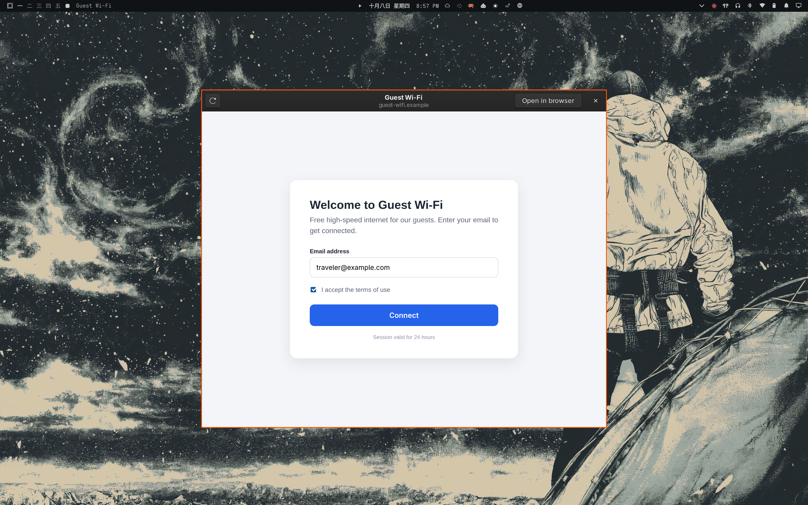

# Wi-Fi Login Popup

An Omarchy plugin that opens the sign-in page of hotel, airport, café and other public Wi-Fi **automatically**, in a small floating window, as soon as you join the network. The window closes itself once you are online.



macOS, iOS, Windows and GNOME all pop up the "log in to this network" window by themselves. Omarchy doesn't. NetworkManager's connectivity check detects the portal, but nothing on the desktop acts on it, so the network just looks broken until you think of opening a plain `http://` page. This plugin fills that gap.

## What it does

- Watches NetworkManager's connectivity state over D-Bus. Nothing is polled.
- When the state becomes **portal**, it shows a "Wi-Fi sign-in required" notification and opens NetworkManager's own plain-http check URL in the popup. The portal intercepts that request just as it intercepted NetworkManager's check, and the popup follows the portal's redirect to its sign-in page.
- Opens the page in a floating, centered WebKitGTK window with **Reload** and **Open in browser** buttons. Storage is ephemeral, so no cookies or history are kept. Rendering is software-only: a sign-in page needs no GPU, and this keeps the GPU driver out of the web process.
- Closes the window once NetworkManager reports full connectivity.
- Opens once per connection. It re-arms when you leave the portal state (logged in, or switched network).
- If the window cannot start, the page opens in your default browser instead.

Your existing network widget stays as it is: this plugin has no bar widget. It works alongside any network widget, including stock Omarchy's.

## Install

Review the repository, then add the plugin:

```bash
omarchy plugin add https://github.com/davidboulay/omarchy-wifi-login-popup.git
```

Accept the prompt to enable it. For an unattended install from a repository you already trust:

```bash
omarchy plugin add https://github.com/davidboulay/omarchy-wifi-login-popup.git --enable --yes
```

### Open the sign-in page by hand

If you closed the popup, or the portal was detected late (NetworkManager re-checks only every few minutes while a portal is pending):

```bash
~/.config/omarchy/plugins/io.github.davidboulay.wifi-login-popup/bin/wifi-login-popup open
```

## Update

```bash
omarchy plugin update io.github.davidboulay.wifi-login-popup
```

## Disable or remove

```bash
omarchy plugin disable io.github.davidboulay.wifi-login-popup
omarchy plugin remove io.github.davidboulay.wifi-login-popup
```

Disabling stops the watcher immediately. The plugin writes no files outside its own folder and edits no configuration, so removing it leaves nothing behind.

## Requirements

Everything ships with a stock Omarchy 4 install:

| Needed | Why | Package |
|---|---|---|
| NetworkManager with its connectivity check enabled (the default) | detects the portal | `networkmanager` |
| WebKitGTK 4.1 + PyGObject | the popup window | `webkit2gtk-4.1` (pulled in by `aether`), `python-gobject` |
| `gdbus`, `busctl`, `nmcli`, `hyprctl` | watching, notifying, naming the network, the float rule | `glib2`, `systemd`, `networkmanager`, `hyprland` |

If the connectivity check is turned off, nothing is ever detected. Check with:

```bash
busctl get-property org.freedesktop.NetworkManager /org/freedesktop/NetworkManager \
  org.freedesktop.NetworkManager ConnectivityCheckEnabled
```

> **Forced DNS breaks portals.** If you pinned DNS to a resolver that is only reachable at home (a Pi-hole or AdGuard on your LAN), the portal's hostname cannot resolve away from home. Use the network's own DNS (DHCP) while travelling.

## How the window floats

The window's Wayland app id is `wifi-login-popup`. Right before each popup, the plugin adds a Hyprland window rule at runtime with `hyprctl eval`: floating, centered, 900×750, fully opaque. Nothing is written into your Hyprland config. The rule disappears at the next config reload and is added again before the next popup. To style it permanently, match `class = "^wifi-login-popup$"` in your own config.

## Security

This plugin runs unsandboxed under `omarchy-shell` while it is enabled. It:

- reads NetworkManager's state over the system D-Bus (read-only);
- loads NetworkManager's own connectivity-check URL, and the portal's sign-in page it redirects to, in an ephemeral WebKitGTK view, with TLS validation left at WebKit's defaults. This happens only while a portal is detected or when you run `open`;
- sends a desktop notification and adds the runtime window rule described above.

It needs no root, installs no system service, downloads nothing, and makes no other network requests.

## License

MIT. See [LICENSE](LICENSE).
